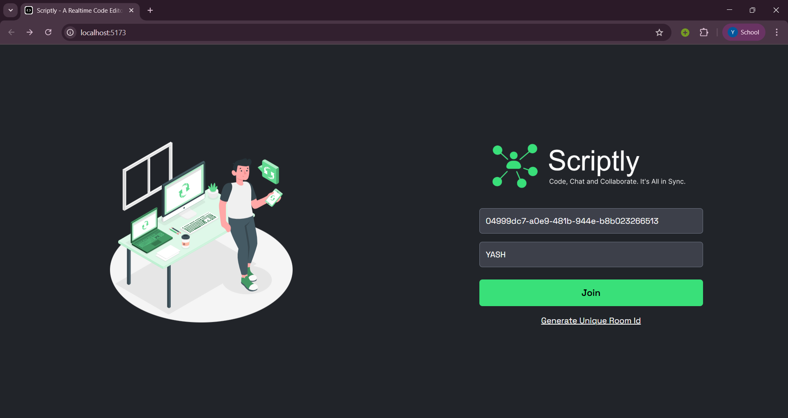
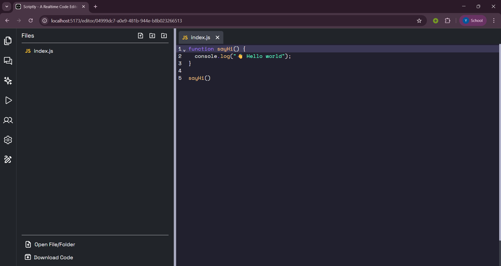
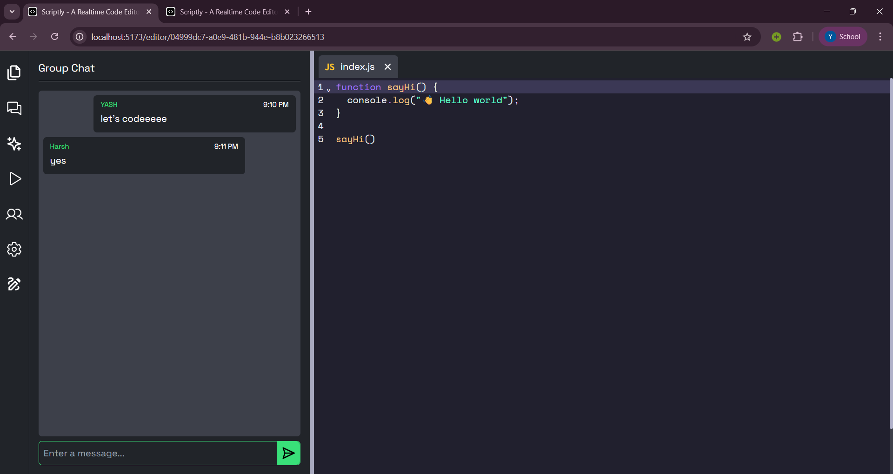
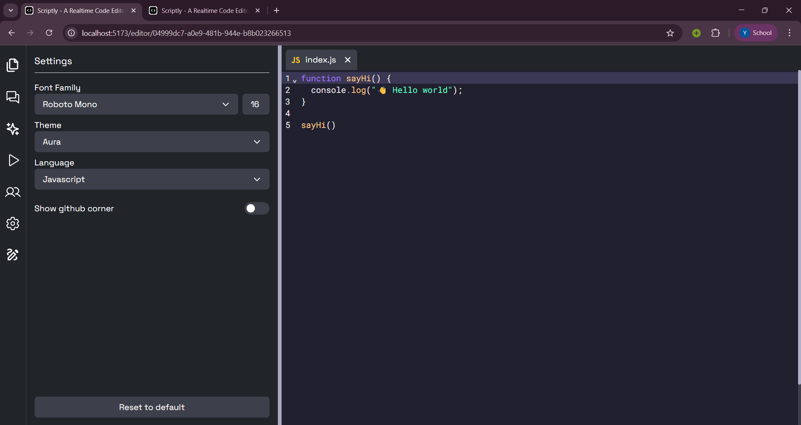

<h1 align="center">Scriptly</h1>
<p align="center">
  <strong>A Real-Time Collaborative Code Editor built with the MERN Stack</strong>
</p>

<p align="center">
  
  
  
  
  
  
</p>

---

Scriptly redefines remote teamwork for developers and students. This MERN-stack application offers a dynamic, real-time environment that eliminates the friction of traditional pair programming. At its core is a powerful editor that supports a vast range of programming languages and is highly customizable with various themes and font styles. By seamlessly integrating a live code editor with real time chatting and file sharing, Scriptly provides a cohesive and efficient workspace. This unified approach ensures that all collaborators are on the same page, turning what was once a clunky, multi-tool process into a fluid and intuitive experience.

---

## 🛠️ Tech Stack
- **Frontend:** React.js, TypeScript, Tailwind CSS  
- **Backend:** MongoDB, Node.js, Express.js, WebSockets (Socket.IO)  
- **Code Execution API:** Piston API (for running code in multiple languages)  

---
## 🚀 Features
- **Real-time Collaborative Editing** – Multiple users can edit the same code file simultaneously.
- **Built-in Chat Support** – Communicate with collaborators directly within the editor.
- **Multiple Language Support** – Run and test code in different programming languages.
- **File Management System** – Create, rename, and delete files in a structured workspace.
- **User Presence & Status** – See who is online and actively editing.
- **Responsive UI** – Clean, modern, and optimized for all screen sizes.
- **Secure Rooms** – Join or create rooms for private collaborative sessions.

---
## 📸 Screenshots

### 🏠 Home Page & 💻 Coding Zone
<p align="center">
  
  
</p>

### 💬 Chats & ⚙️ Settings
<p align="center">
  
  
</p>
---

## ⚡ Installation & Setup

### 1. Clone the Repository
```bash
git clone https://github.com/<your-username>/Scriptly.git
cd Scriptly
```
### 2. Install dependencies
```bash
cd client
npm install
cd ../server
npm install
```

### 3. Setup .env file

### 4. Run the app
```bash
cd server
npm run dev
cd client
npm run dev
```

